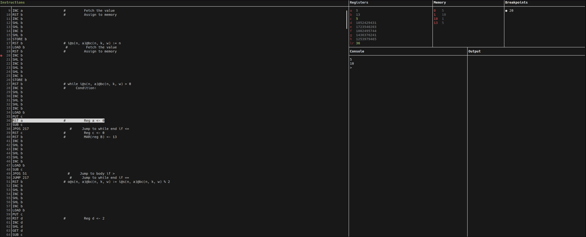

# Compiler
The program compiles a pascal-like language to a register-based machine bytecode.
It features two version, the first one maps each of the variables to a place in memory
(i.e. spills all variables) and uses pre-defined registers for each of the bytecode instructions.
The second, improved version, build a cfg and then performs register allocation.
Both versions perform basic optimizations like function inlining and dead code removal.
### The grammar
```
program_all     -> procedures main
procedures      -> procedures PROCEDURE proc_head IS declarations IN commands END
                   | procedures PROCEDURE proc_head IS IN commands END
                   | ε
main            -> PROGRAM IS declarations IN commands END
                   | PROGRAM IS IN commands END
commands        -> commands command
                   | command
command         -> identifier := expression ;
                   | IF condition THEN commands ELSE commands ENDIF
                   | IF condition THEN commands ENDIF
                   | WHILE condition DO commands ENDWHILE
                   | REPEAT commands UNTIL condition ;
                   | proc_call ;
                   | READ identifier ;
                   | WRITE value ;
proc_head       -> pidentifier ( args_decl )
proc_call       -> pidentifier ( args )
declarations    -> declarations , pidentifier
                   | declarations , pidentifier [ num ]
                   | pidentifier
                   | pidentifier [ num ]
args_decl       -> args_decl , pidentifier
                   | args_decl , T pidentifier
                   | pidentifier
                   | T pidentifier
args            -> args , pidentifier
                   | pidentifier
expression      -> value
                   | value + value
                   | value - value
                   | value * value
                   | value / value
                   | value % value
condition       -> value = value
                   | value != value
                   | value > value
                   | value < value
                   | value >= value
                   | value <= value
value           -> num
                   | identifier
identifier      -> pidentifier
                   | pidentifier [ num ]
                   | pidentifier [ pidentifier ]
```
### The virtual machine
The virtual machine features 8 registers, $(r_a, r_b, r_c, r_d, r_e, r_f, r_g, r_h)$, a program counter $k$
and $2^{62} + 1$ memory cells.
Values stored in the registers and the memory are unbounded, unsigned integers.
The bytecode instructions set is as follows:
| Instruction | Description                                               | Time    |
|-------------|-----------------------------------------------------------|---------|
| READ        | takes number from stdin and stores in $r_a$, k ← k + 1    | 100     |
| WRITE       | outputs r_a to stdout, k ← k + 1                          | 100     |
| LOAD x      | ra ← prx, k ← k + 1                                       | 50      |
| STORE x     | prx ← ra, k ← k + 1                                       | 50      |
| ADD x       | ra ← ra + rx, k ← k + 1                                   | 5       |
| SUB x       | ra ← max{ra − rx, 0}, k ← k + 1                           | 5       |
| GET x       | ra ← rx, k ← k + 1                                        | 1       |
| PUT x       | rx ← ra, k ← k + 1                                        | 1       |
| RST x       | rx ← 0, k ← k + 1                                         | 1       |
| INC x       | rx ← rx + 1, k ← k + 1                                    | 1       |
| DEC x       | rx ← max{rx − 1, 0}, k ← k + 1                            | 1       |
| SHL x       | rx ← 2 ∗ rx, k ← k + 1                                    | 1       |
| SHR x       | rx ← ⌊rx/2⌋, k ← k + 1                                    | 1       |
| JUMP j      | k ← j                                                     | 1       |
| JPOS j      | jeśli ra > 0 to k ← j, w p.p. k ← k + 1                   | 1       |
| JZERO j     | jeśli ra = 0 to k ← j, w p.p. k ← k + 1                   | 1       |
| STRK x      | rx ← k, k ← k + 1                                         | 1       |
| JUMPR x     | k ← rx                                                    | 1       |
| HALT        | zatrzymaj program                                         | 0       |

# Debugger


